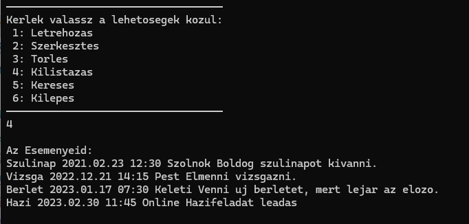

# Határidőnapló Program (C)

Egyszerű határidőnapló alkalmazás C nyelven, események tárolására és kezelésére.

## Funkciók

- Új esemény hozzáadása (név, dátum, helyszín, megjegyzés)
- Esemény keresése név alapján
- Esemény törlése név alapján
- Esemény adatainak módosítása
- Események listázása dátum szerinti sorrendben
- Adatok mentése fájlba kilépéskor
- Adatok betöltése fájlból induláskor

## Használt technológiák

- **C nyelv** (`stdio.h`, `stdlib.h`, `string.h`)
- **Dinamikus memóriafoglalás** (`malloc`, `free`)
- **Fájlbkezelés** (`fopen`, `fprintf`, `fscanf`, `fclose`)

## Struktúrák

- **Esemény**:
  - Név
  - Dátum
  - Helyszín
  - Megjegyzés

- **Listaelem**:
  - Egy eseményt tárol
  - Pointer a következő listaelemre

## Fő műveletek

### Hozzáadás
- Új eseményt szúr be a megfelelő dátum szerinti helyre a listában.
- Az adatok bemásolása után a lista sorrendjét fenntartva kapcsolja be az új elemet.

### Megkeresés
- A név alapján keres eseményt.
- Az első találatot adja vissza pointerként.

### Törlés
- Keresés után eltávolítja az eseményt a listából.
- Külön figyeli, ha a törlendő elem az első a listában.

### Módosítás
- Megkeresi a módosítandó eseményt.
- Törli a meglévő eseményt, majd újra hozzáadja az új adatokkal.

### Mentés
- A teljes lista fájlba írása (`mentes.txt`).
- Minden esemény egy sorba kerül.

### Betöltés
- Program indulásakor betölti az eseményeket a `mentes.txt` fájlból.
- Soronként olvassa be az adatokat és felépíti a listát.

### Memóriakezelés
- Minden listaelemhez dinamikus memóriafoglalás történik.
- Program bezárásakor a teljes lista memóriafelszabadítása megtörténik.

## Megjegyzések

- A program gondoskodik arról, hogy helyes sorrendben legyenek az események (időrendben).
- Hibakezelést minimálisan tartalmaz: pl. fájlműveletek ellenőrzése.
- Fájlformátum egyszerű, könnyen olvasható.

**Fejlesztő**: Szakács Olivér  
**Tantárgy**: Programozás alapjai 2

